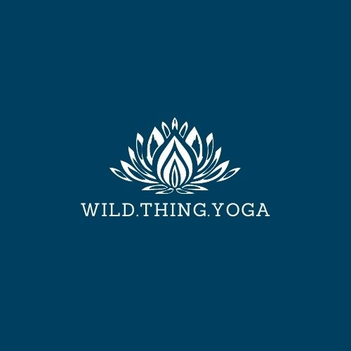
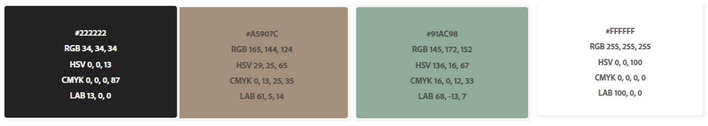

<h1 align=center>Wild Thing Yoga</h1>
<h2 align="center"></h2>

Code Institute, Diploma in Full Stack Software Development Milestone Project 1, 
December 2020.

# Table of Contents 
1. [Strategic Purpose](#strategic-purpose)
    * [Design Simulation](#design-simulation)
2. [User Experience Design](#user-experience-design)
   * [User Stories](#user-stories)
        * [First Time Visitor Goals](#first-time-visitor-goals)
        * [Returning Visitor Goals](#returning-visitor-goals)
        * [Frequent Visitor Goals](#frequent-visitor-goals)

    *  [Design](#design)
        * [Structure](#structure)
        * [Wireframes](#wire-frames)
        * [Color Scheme](#color-scheme)
        * [Typography](#typography)
        * [Imagery](#imagery)
        * [Design Limitations](#design-limitations)

3. [Features](#features)
4. [Technologies](#technologies)
    * [Languages](#languages)
        * HTML
        * CSS
    * [Frameworks Libraries & Programmes](#frameworks-libraries-&-programmes)
        * GitHub
        * Git/GitPod
        * Bootstrap v4.5
        * Google Fonts
        * Canva
        * Adobe Color Wheel
        * Balsamiq
        * Am I Responsive
        * MicroSoft Snipping Tool
        
    
5. [Testing](#testing)
6. [Deployment](#deployment)
7. [Credits](#credits)
8. [Conclusion](#conclusion)

## Strategic Purpose
This website is created to be the official marketing tool for my business "Wild Thing Yoga".
It should be a asset to the business to increase growth and improve rates of student retention 
while also being a of value to the students, improving their customer experience.

The site will be a place for students and potential students to learn about our offering, 
book classes,contact us and avil of free resources. 

Features are to entice new students to join, add value for existing students while also cutting down 
on correspondance for the business regarding frequently asked questions. 

Content should be clear, informative and adapted for screen readers so it is accessible for all.
The site is to be responsive on all devices, while being easy and enjoyable to navigate through. 
Creating a positive user experience for customers that they will return to again and again.

### Design Simulation
TBA ****
___

## User Experience Design

### User Stories
#### First Time Visitor Goals

> - Easily understands the main purpose and navigation pathways of the site
> - Information is clearly presented and easily absorbed with minimal effort
> - Features load quickly, are adapted to my device, my needs and supported by my browser
> - I can learn more about the offering and their interaction with others via social
 media or through testimonials to determine whether they are trustworthy and of value to me

#### Returning Visitor Goals
> - Easily learn of upcoming classes and book those classes
> - Access contact information
> - Avail of free resources

#### Frequent Visitor Goals
> - Check the class schedule and book classes
> - Check for new free resources
> - Learn of changes to their offering, discounts and events

### Design
#### Structure

The site will be made up of 3 pages with 2 to 3 sections on each page, all pages will have a
'sticky' navigation bar and a footer containing contact information. 

The Home page will have links to book a class, images of the studio and past classes,
testimonials, frequently asked questions and an option to submit a question or subscribe
to our newsletter if they want to.

The booking page will have our class schedule, pricing information and a booking form.

The free resources page will have topical articals and online tutorials, which will be updated 
reguarly.

#### Wireframes
TBA ******

#### Color Scheme

The above color swatch shows a guide line for the color scheme of the site.
Colors are brand colors which have been adopted for the following reasons: 
 

Color | Consumer Association
------|---------------------
Blue | Peaceful, trustworthy, loyalty with a soothing & calming effect
Teals/Green | Acepting, supportive, growth, recurrance, safety & balance
White | Goodness, purity, safety & new beginnings
Grey | Stable, calm, composure, quiet & reserved, transitional

All colours tie together to make the appropriate emotional responce
and associations the brands identifies with their business, yoga 
and a yoga practice.  

<em>Please see [credits](#Credits) section for links to color psychology sources.</em>

#### Typography

The Sanchez font, created by [<em>Daniel Hernandez</em>](https://fonts.google.com/specimen/Sanchez?query=sanchez) will be the main font for
the company name and headings, Raleway which is hosted on google fonts also, by multiple creators,
will be the secondary font used for the body of text. Sans Serif will be the fallback font
if for any reason the main fonts are not being imported or displayed correctly. 
This pairing has clean lines, with a good contrast in weight and lends well to a sense of 
profesionalism.

#### Imagery
Branding is an important marketing tool so a logo has been developed using 
[<em>Canva.com</em>](https://www.canva.com/design/DAEOhUvrb0E/PlrtIsOaalfq_bSkxw6D8w/edit?layoutQuery=lotus+logo),
this logo will feature throughout the website. Images will be supplied
by myself or from open sources,  please see [<em>credits</em>](#credits) for a list of sources and photographers.

#### Design Limitations
A 'funkier' more modern layout was originally designed but outside the scope of 
my current capabilities. A fourth and fifth page for a community forum and merchandise/equipment shop
will be implimented in the future but was not possible due to time constraints.

## Features
 - Responsive on all devices
 - Supported by all browsers
 - Interactive Elements
 - Adapted for users with special accessibility requirements where possible

 ## Technologies

 ### Languages

 - [HTML](https://www.w3schools.com/html/)
 - [CSS](https://www.w3schools.com/css/default.asp)

 ### Frameworks Libraries & Programs Used

  1. [Git Hub](https://github.com/janeyrinn/Wild_Thing_Yoga) Used to store and share the projects code.
  2. [Git/GitPod](https://fde7900b-2e73-4d3d-8066-0c3a506e1ef2.ws-eu01.gitpod.io/#/workspace/Wild_Thing_Yoga) Used for creation, version control and to commit and push to Git Hub.
  3. [Bootstrap v4.5](https://getbootstrap.com/) Used for responsivness and styling of the site.
  4. [Google Fonts](https://fonts.google.com/) Used to import the Sanchez and Raleway fonts.
  5. [Canva](https://www.canva.com/) For creation of the logo.
  6. [Adobe Color Wheel](https://color.adobe.com/create/image-gradient) Image gradient feature was used to extract colors used in the logo and build a colour theme.
  7. [Balsamiq](https://balsamiq.com/) Used to create wireframes during the design process.
  8. [Am I Responsive](http://ami.responsivedesign.is/) Used to check responsivity of code and display the mock up in the documentation.
  9. [MicroSoft Sniping Tool](https://support.microsoft.com/en-us/windows/use-snipping-tool-to-capture-screenshots-00246869-1843-655f-f220-97299b865f6b) Used for various images, such as the color swatch and
  extraction of usedful information for my project drafts and plans.

## Testing
## Deployment
## Credits
## Conclusion