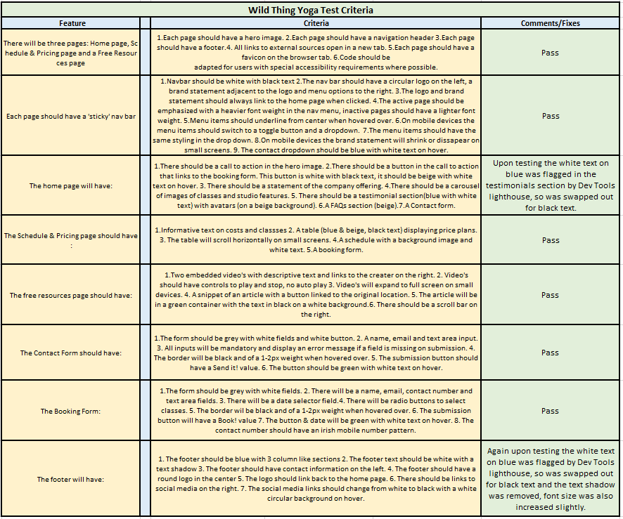
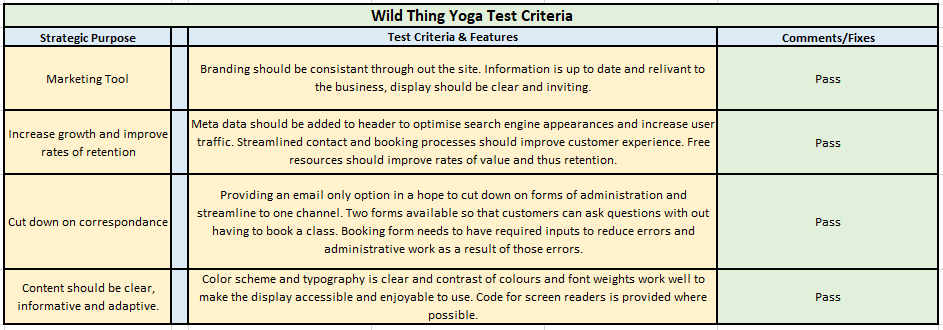

<h1>Wild Thing Yoga </h1>

Code Institute, Diploma in Full Stack Software Development Milestone Project 1, 
December 2020.

# Table of Contents 
1. [Strategic Purpose](#strategic-purpose)
    * [Design Simulation](#design-simulation)
2. [User Experience Design](#user-experience-design)
   * [User Stories](#user-stories)
    *  [Design](#design)
        * [Structure](#structure)
        * [Wireframes](#Wireframes)
        * [Color Scheme](#color-scheme)
        * [Typography](#typography)
        * [Imagery](#imagery)
        * [Design Limitations](#design-limitations)
        * [Design Differences](#design-differences)
3. [Features](#features)
4. [Technologies](#technologies)
5. [Deployment](#deployment)
    * [Deployment via GitHub Pages](#Deployment-via-GitHub-Pages)
    * [Making a Clone in GitPod](#Making-a-Clone-in-GitPod)
6. [Testing](#testing)
    * [Funtionality and Features](#Funtionality-and-Features)
    * [User Stories Test](#User-Stories-Test)
    * [Strategic Purpose Test](#Strategic-Purpose-Test)
    * [Bugs and Fixes](#Bugs-and-Fixes)
    * [Testing Limitations](#Testing-Limitations)
7. [Credits](#credits)
    * [Images](#Images)
    * [Content](#Content)
    * [Color Psychology](#Color-Psychology)
    * [Code](#Code)
    * [Acknowledgements](#Acknowledgements)

## Strategic Purpose
This website is created to be the official marketing tool for my business "Wild Thing Yoga".
It should be an asset to the business to increase growth and improve rates of student retention 
while also being of value to the students and improving their customer experience.

The site will be a place for students and potential students to learn about our offering, 
book classes, contact us and avail of free resources. 

Features are to entice new students to join classes, add value for existing students while also cutting down 
on correspondance for the business, regarding frequently asked questions and errors caused by typo's
or lack of information. 

Content should be clear, informative and adapted for screen readers so it is accessible for all.
The site is to be responsive on all devices, while being easy and enjoyable to navigate through. 
Creating a positive user experience for customers that they will return to again and again.

### Design Simulation

The live site can be found <a href="https://janeyrinn.github.io/Wild_Thing_Yoga/" target="_blank">here</a>

## User Experience Design

### User Stories
#### First Time and Returning Visitor Goals

As a user I would like to : 
>- easily understands the main purpose and navigation pathways of the site.
>- find information is clearly presented and easily absorbed with minimal effort.
>- find that features load quickly.
>- find that features are adapted to my devices screen size.
>- learn more about the companys offering.
>- have basic questions I may have answered without having to contact the organization.
>- learn about their interaction with others via social media. 
>- learn about their service quality through testimonials.
>- easily learn of upcoming classes.
>- learn about price of their classes.
>- book classes.
>- access contact information.
>- find their location.
>- contact the organization.
>- avail of free resources.

### Design
#### Structure

The site will be made up of 3 pages with 2 to 3 sections on each page, all pages will have a
'sticky' navigation bar and a footer containing contact information. 

The Home page will have links to book a class, images of the studio and past classes,
testimonials, frequently asked questions and an option to submit a question.

The booking page will have our class schedule, pricing information and a booking form.

The free resources page will have topical articals and online tutorials, which will be updated 
reguarly.

#### Wireframes
A mock up of how the site will be layed out is available here via [Wire Frames](assets/wireframes.pdf).

#### Color Scheme

The above color swatch shows a guide line for the color scheme of the site, 
black and white will also be incorporated.
Colors are brand colors which have been adopted for the following reasons:
 

Color | Consumer Association
------|---------------------
Black | Elegance, sophistication
Beige | Neutral, calming, relaxing, dependable
Green | Growth, recurrance, safety & balance
White | Goodness, purity, safety & new beginnings
Blue  | Serenity, reliable
Grey  | Neutral, balance

All colours tie together to make the appropriate emotional responce
and associations the brands identifies with their business, yoga 
and a yoga practice. The colours also combine for effective and an easy to 
read layout.  

<em>Please see [credits](#Credits) section for links to color psychology sources.</em>

#### Typography

The Dancing Script font, created by [<em>Pablo Impallari</em>](https://fonts.google.com/specimen/Dancing+Script?query=dancing#about) will be the main font for
the company name and headings, Raleway which is hosted on google fonts also, by multiple creators,
will be the secondary font used for the body of text. Sans Serif will be the fallback font
if for any reason the main fonts are not being imported or displayed correctly. 
This pairing has clean lines, with a good contrast in weight and lends well to a sense of 
profesionalism.

#### Imagery
Branding is an important marketing tool so a logo has been developed using 
[<em>Canva.com</em>](https://www.canva.com/),
this logo will feature throughout the website. Images will be supplied
by myself or from open sources,  please see [<em>credits</em>](#credits) for a list of sources and photographers.

#### Design Limitations
A fourth and fifth page for a members log in and merchandise/equipment shop
will be implimented in the future but was not possible due to time constraints. The forms
are not functioning for the business at present and do not have method="POST" or "action=" included as there is no where to "post" to yet. 
This is due to the mechanisms of that feature being outside the scope of the project.

#### Design Differences
An additional table was added to the Pricing & Schedule page after the wireframes were created.
The footer in the wireframes is a little different from execution but the concept and desired function is ultimately the same.

## Features
 1. Responsive to different screen sizes.
 2. Supported by Chrome, Microsoft Edge and Firefox browsers.
 3. Adapted for users with special accessibility requirements where possible.
 4. There will be three pages: Home page, Schedule & Pricing page and a Free Resources page. 
        - Each page will have a hero image. 
        - Each page will have a navigation header 
        - Each page will have a footer.  
        - Each page will have a favicon on the browser tab. 
        - Each page will have a favicon on the browser tab. 
        - All links to external sources will open in a new tab. 
 5. Each page will have a 'sticky' nav bar. 
        - Navbar will be white with black text. 
        - The nav bar will have a circular logo on the left, a brand statement adjacent to the logo and menu options to the right. 
        - The logo and brand statement will always link to the home page when clicked. 
        - The active page will be emphasized with a heavier font weight in the nav menu, inactive pages will have a lighter font weight. 
        - Menu items will underline from center when hovered over. 
        - On mobile devices the menu items will switch to a toggle button and a dropdown.  
        - The menu items will have the same styling in the drop down. 
        - On mobile devices the brand statement will shrink or dissapear on small screens. 
 6. The home page will have: 
        - A call to action in the hero image. 
        - A button in the call to actio that links to the booking form. 
        - A statement of the company offering. 
        - A carousel of images of classes and studio features. 
        - A testimonial section(blue with white text) with avatars (on a beige background). 
        - A FAQs section (beige). 
        - A Contact form. 
7. The Schedule & Pricing page will have:  
        - Informative text on costs and classses. 
        - A table (blue & beige, black text) displaying price plans.  
        - The table will scroll horizontally on small screens. 
        - A schedule with a background image and white text. 
        - A booking form. 
8. The free resources page will have: 
        - Two embedded video's with descriptive text and links to the creater on the right. 
        - Video's will have controls to play and stop, no auto play. 
        - Video's will expand to full screen on small devices. 
        - A snippet of an article with a button linked to the original location. 
        - The article will be in a green container with the text in black on a white background. 
        - There will be a scroll bar on the right. 
9. The Contact Form wil have: 
        - The form will be grey with white fields and white button. 
        - A name, email and text area input. 
        - All inputs will be mandatory and display an error message if a field is missing on submission. 
        - The border wil be black and of a 1-2px weight when hovered over. 
        - The submission button will have a Send it! value. 
        - The button will be green with white text on hover. 
10. The Booking Form: 
        - The form will be grey with white fields. 
        - There will be a name, email, contact number and text area fields 
        - There will be a date selector field. 
        - There will be radio buttons to select classes. 
        - The border wil be black and of a 1-2px weight when hovered over. 
        - The submission button will have a Book! value. 
        - The button & date will be green with white text on hover. 
11. The footer will have:
        - The footer will be blue with 3 column like sections 
        - The footer text will be white with a text shadow. 
        - The footer will have contact information on the left. 
        - The footer will have a round logo in the center. 
        - The logo will link back to the home page. 
        - There will be links to social media on the right. 
        - The social media links will change from white to black with a white circular background on hover. 

 ## Technologies

 ### Languages

 - [HTML](https://www.w3schools.com/html/)
 - [CSS](https://www.w3schools.com/css/default.asp)

 ### Frameworks Libraries & Programs

  1. [Git Hub](https://github.com/janeyrinn/Wild_Thing_Yoga) Used to store and share the projects code)
  2. [Git/GitPod](https://fde7900b-2e73-4d3d-8066-0c3a506e1ef2.ws-eu01.gitpod.io/#/workspace/Wild_Thing_Yoga) Used for creation, version control and to commit and push to Git Hub.
  3. [Bootstrap v4](https://getbootstrap.com/) Used for responsivness and styling of the site.
  4. [Google Fonts](https://fonts.google.com/) Used to import the Sanchez and Raleway fonts.
  5. [Font Awesome](https://fontawesome.com/v4.7.0/) Used for footer icons.
  6. [Canva](https://www.canva.com/) For creation of the logo.
  7. [Adobe Color Wheel](https://color.adobe.com/create/image-gradient) Image gradient feature was used to extract colors used in the logo and build a colour scheme.
  8. [Balsamiq](https://balsamiq.com/) Used to create wireframes during the design process.
  9. [Am I Responsive](http://ami.responsivedesign.is/) Used to check responsivity of code and display the mock up in the documentation.
  10. [MicroSoft Sniping Tool](https://support.microsoft.com/en-us/windows/use-snipping-tool-to-capture-screenshots-00246869-1843-655f-f220-97299b865f6b) Used for various images, such as the color swatch and
  extraction of usedful information for my project drafts and plans.
  11. [Microsoft Photo Editor](https://support.microsoft.com/en-us/windows/edit-photos-and-videos-in-windows-10-a3a6e711-1b70-250a-93fa-ef99048a2c86) Used for editing the resolution of photos in the carosel 
  to tone in with the colour scheme.
  12. [Free Formatter](https://www.freeformatter.com/html-formatter.html) Was used in place of extensions due to an error on GitPod caused by a recent update.
  13. [W3C](https://validator.w3.org/) used to validate HTML code.
  14. [W3c Jigsaw](https://jigsaw.w3.org/css-validator/) used to validate CSS code.

## Deployment

#### Deployment via GitHub Pages

1. Select the <b>Repository</b> you wish to deploy.
2. Under the <em>"Repo"</em> name on the top left of the screen
there is a menu,  select the settings tab on this menu.
3. Scroll down to the <b>GitHub Pages</b> section.
4. Under <b>Source</b> use the <b>None or Branch</b> drop down menu to select the 
publishing source you wish to use. <b>Main</b> is recommened.   
5. Select <b>Save</b> and refresh the page. 
6. Your published address will appear in a green highlighted container above <b>Source</b>.
7. Click the link to test it works.

#### Making a Clone in GitPod
1. Select the <em>Repo</em> you wish to clone in GitHub.
2. Click on the Code dropdown button.   
3. Copy the link to your clipboard.
4. Open Git Bash.
5. In the console type <em>"git clone"</em> and paste the copied link.
6. Hit enter to create the clone. 
    - To view what the code will look like in a browser from here type <em>" python3 -m http.server"</em>
into the console and hit enter.
    - A pop up will appear stating "A service is available on Port 8000" select <b>Open Browser</b>

## Testing

Testing is will be carried out under three premises : User Stories,the Businesses Strategic purpose and features.

Testing will be for 3 browsers : Chrome v87, Microsoft Edge v87 & Mozilla Firefox v83.

Testing was documented using Microsoft Excel and the full spreadsheet can be found [here](/assets/testing.xlsx).
Screen schots of all results are below.

HTML and CSS  semantics and validity was tested through out with [W3C](https://validator.w3.org/) for HTML
and [W3c Jigsaw](https://jigsaw.w3.org/css-validator/) for CSS.

#### Funtionality and Features

#### User Stories Test 

#### Strategic Purpose Test

##### Bugs and Fixes

- Jumbotron sizing issues : The jumbotron and booking button were not responsive on different screen sizes.
This was combatted with reducing the font size of the "h1" element and targeted @MediaQueries. The font size increases for screens
of 1200px and above, for screen sizes of 768px width and below the font size reduces and the top margin increasess.
The margin increase is to push the "h1" out from under the NavBar. The button reduces in size with a media query also
for screens 850px and below. Widths were determined by researching break points and through trial and error testing.
- Brand text in the NavBar sizing issue: The brand text in the nav bar is also controlled for resposivness with 
media queries as it was too large in some screens and sending the toggle button below the logo. This still happens 
but only on very small screens and is part of the bootstrap design. The brand text now decreases in size on smaller screens 
and completely dissapears on very small screens.
- Carousel: the way the carousel was origianally written in the HTML it was creating a white space to the right of the 
hero image. The carousel was placed inside a container "div" to combat this.
- Deployed links: Internal links were not working when the site was first deployed. File paths were updated 
to include the website name to show the correct location in the public site.
- Footer display: the font in the footer wasn't as strong and easily read as I had hoped and this was combatted by adding a
text shadow.

##### Testing Limitations
Testing was limited to the three browsers mentioned above, although I had wished to have the site function on Safari
as it is a popular browser I could not. I do not own an Apple Mac or Tablet and you can no longer download Safari for Windows.I reached out to colleagues
and friends to assist with Safari testing but I am not confident to include the results for the purpose of the MS1. 

## Credits

#### Images 
Thank you to the following photographers and open source platforms for use and supply of their images.
1. Callout Image : Creater & owners own, taken by a friend, 2018.
2. Offering Carousel images : [Elly Sazonova](https://www.pexels.com/@elly-fairytale): Class Images, 
[Vecislavas Popa](https://www.pexels.com/@fotoaibe) : Shower Image, [Andrea Piacquadio](https://www.pexels.com/@olly) : Reception Image, all at [Pexels](https://www.pexels.com/).
3. Testimonial Avatars: Artist unknown at [Undraw](https://undraw.co/)
4. Schedule & Pricing : [Elly Sazonova](https://www.pexels.com/@elly-fairytale): Hero Image. [CottonBro](https://www.pexels.com/@cottonbro): Schedule background image.
5. Free Resources Hero Image : [Aaron Burden](https://unsplash.com/@aaronburden) at [Unsplash](https://unsplash.com/)

#### Content
Thank you to the following for sharing their content with our free resouces page.
1. [Adrienne Mishler](https://yogawithadriene.com/adriene-mishler/) supplied YouTube Yoga tutorial video.
2. [Sarah Blondin](https://www.sarahblondin.com/) supplied YouTube guided Meditation video.
3. [Kathryn Ashworth](https://yogainternational.com/profile/kathryn-ashworth) at Yoga International supplied [Ram Dass](https://www.ramdass.org/) interview article.

#### Color Psychology
1. [Black](https://ie.oberlo.com/blog/color-psychology-color-meanings)
2. [Green](https://www.shutterstock.com/blog/complete-guide-color-in-design)
3. [White](https://zevendesign.com/color-association/#white)
4. [Beige](https://www.bourncreative.com/meaning-of-the-color-beige/)
5. [Blue](https://www.verywellmind.com/the-color-psychology-of-blue-2795815#:~:text=The%20Psychology%20of%20Blue,-According%20to%20color&text=Blue%20calls%20to%20mind%20feelings,their%20advertising%20and%20marketing%20efforts)
6. [Grey](https://ie.oberlo.com/blog/color-psychology-color-meanings#:~:text=In%20color%20psychology%2C%20grey%20represents,of%20color%20makes%20it%20dull)

#### Code
Special thanks to :
1. The [Stack Over Flow](https://stackoverflow.com/questions/11948245/markdown-to-create-pages-and-table-of-contents) community for assistance with additional learning in semantics and fixing errors, particularly with the table of contents in my "Read Me".
2. The [Web Dev Tutorials](https://www.youtube.com/watch?v=LbYKqXBy2hI) for assistance with targeting and customizing a Bootstrap NavBar.
3. The [Tips with Punch](https://www.youtube.com/watch?v=9YffrCViTVk) watched before embedding my Youtube video's.

#### Acknowledgements
Special thanks to:
1. The tutors at Code Institute for their guidence and support, in particular 
Amanda and Tim for their help with Nav issues and their great attitude.
2. My mentor Rohit Sharma for his guidance and advice through out.
3. My peers on the slack community for assistance with testing and guidance throughout the project.